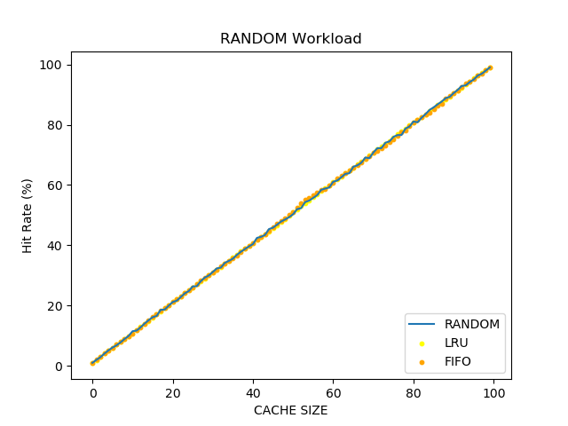
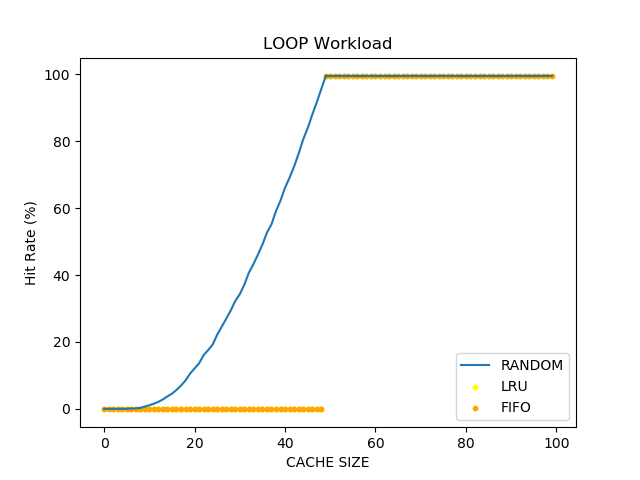
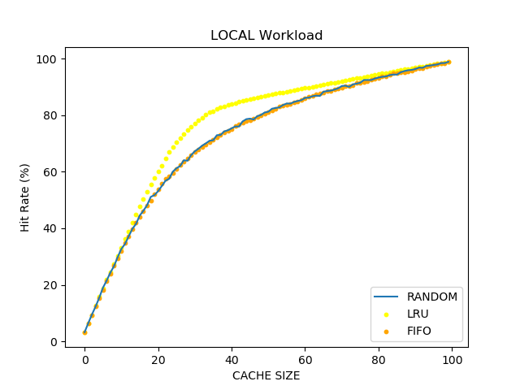
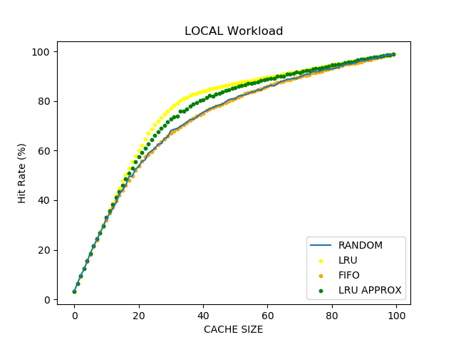

# Summary
Compare the performance of differnt page replacement policy on three different workloads.

### Comparision of following policies

- RANDOM
- FIFO
- LRU
- LRU Approx

### On following workloads
- No-Locality
- LOCAL (80-20)
- Looping

## Performance measure graphs of differnt workloads-

#### No-Locality

#### LOOP

#### LOCAL (80-20 Policy)

#### LOCAL (with LRU Approx) (80-20 Policy)



## Time complexity and space complexity measure for differnt policies for single work of a workload
- RANDOM
  - space complexity : O(|SIZE OF CACHE|)
  - time complexity :  O(1)[for hit]+ O(|SIZE OF CACHE|) [for miss]
- FIFO
  - space complexity : O(1)
  - time complexity :  O(1)[for hit and miss]

- LRU
  - space complexity : O(1)
  - time complexity:  O(1)[for hit and miss]

- LRU Approx
  - space complexity : O(|SIZE OF CACHE|)
  - time complexity :  O(1)[for hit]+ O(|SIZE OF CACHE|) [for miss]

Each policy implementation uses a hashmap and a doubly linked list queue (FIFO). Hashmap stores the pointers to the nodes in doubly liked list with index being the page number.

## Setup

#### Clone the project --
- git clone https://github.com/ac-optimus/pagging_policy_measure
- For plot see requirements.txt or install using `pip install -r requirements.txt`
### run test
```
make test
```
### Run performance analysis
```
make
```
### Usage
See the plots in `plots/`

#### Cleaning
```
make clean
```
#### Note: [Resource](http://pages.cs.wisc.edu/~remzi/OSTEP/vm-beyondphys-policy.pdf)